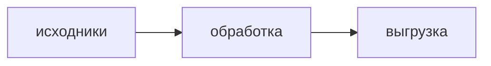

# Описание проекта: формат `options/description.md` и его рендер

> Контракт между локальным клиентом (`fs.manager.tauri`) и сайтом. Составлен 2026-08-19.
> Зеркало этого файла живёт в репозитории клиента:
> `fs.manager.tauri/ideasAndTest/DESCRIPTION_FORMAT_CONTRACT.md` — правки согласовывать в обе
> стороны.
>
> **Состояние на 2026-08-19:** сделано с обеих сторон. В программе — правка сразу в
> отрисованном виде (Tiptap 3) с запасным режимом «текст markdown + превью». На сайте — показ
> (`components/markdown/markdown-view.tsx`) и та же пара способов правки: сериализатор,
> расширения Tiptap и разбор markdown → HTML перенесены из программы файл в файл, чтобы описание
> с двух сторон сохранялось одинаково.
>
> Связанные: [`STORAGE_API.md`](./STORAGE_API.md) (сайдкары), [`UI_TOKENS.md`](./UI_TOKENS.md)
> (палитра, §3 ниже), [`PROJECT_OPTIONS_PANEL.md`](./PROJECT_OPTIONS_PANEL.md).

---

## 1. Откуда берётся текст

Файл `options/description.md` внутри проекта — **третий служебный сайдкар**, наравне с
`options.json` и `folderState.json`:

| что | значение |
|---|---|
| канал | `GET/PUT /api/storage/v1/sidecars?name=description`, `kind: "raw"`, конкурентность `ifMatch` |
| ключ | канонический `projectDescriptionKey` — тот же механизм, что у двух других сайдкаров |
| каталог | строки в `project_files` нет: ни `file_id`, ни значка синхронизации, ни `fileId` в дельте. Событие сайдкара без `fileId` — норма |
| кодировка | UTF-8, без BOM, переводы строк `\n` |
| источник истины | сам файл. В Postgres описание не дублировать вторым источником — только кэш, если понадобится |
| размер | клиент предупреждает автора после ~2 МБ. Картинки лежат внутри файла (§4), а `PUT` с `ifMatch` возит его целиком |
| front-matter | в v1 не используется, зарезервирован. Если появится — YAML в начале, и его надо не печатать как текст |

Клиент просто пишет файл на диск, дальше срабатывает его вотчер. Обратное направление
(правка на сайте → `pull_sidecar` у клиента) уже работает.

---

## 2. Формат: CommonMark + GFM + закрытый список HTML

Базис — **CommonMark** плюс **GFM**: таблицы, чеклисты (`- [ ]`), зачёркивание (`~~s~~`),
автоссылки. Того, чего в markdown нет, ровно восемь тегов:

| тег | атрибуты | зачем |
|---|---|---|
| `u` | — | подчёркивание |
| `mark` | — | быстрая подсветка «по умолчанию» |
| `span` | `class` только из палитры §3: `fg-*` (цвет текста) и/или `bg-*` (заливка) | цвет и подсветка |
| `div` | `class` = `align-center` \| `align-right` \| `align-left` \| `align-justify` | выравнивание блока |
| `p` | `class` = `indent` | красная строка |
| `br` | — | перевод строки внутри абзаца |
| `details` / `summary` | — | сворачиваемый блок («спойлер») |
| `img` | `src`, `alt`, `title` | картинки, §4 |

**Запрещено:** `style`, `width`, `height`, `align`-атрибут (кроме `th`/`td`, см. §7), `class` вне
списка, `script`, `iframe`, `object`, `embed`, `form`, `on*`, `id`.

Почему цвет классом, а не `style="color:#…"`: содержимое `style` санитайзером надёжно не
отфильтровать (это разбор CSS), а список допустимых значений `class` проверяется точно. Плюс
класс мапится в ваш токен — что прямо требует [`UI_TOKENS.md`](./UI_TOKENS.md) («хардкод `#hex` /
`rgba()` — ошибка ревью»).

### Грабля markdown, если будете писать свой редактор

Блочный HTML **съедает** markdown внутри себя. Так жирный не сработает:

```html
<div class="align-center">**жирный по центру**</div>
```

А так сработает — пустые строки возвращают парсер в режим markdown:

```html
<div class="align-center">

**жирный по центру**

</div>
```

Клиентский тулбар вставляет блочные обёртки с пустыми строками. Любой другой генератор обязан
делать то же.

---

## 3. Палитра — на ваши токены, новых цветов не нужно

В файле лежит **имя**, не цвет: `<span class="fg-yellow">`. Все десять имён закрываются уже
существующими токенами:

| класс в файле | ваш токен | HSL | смысл у нас |
|---|---|---|---|
| `fg-blue` | `--primary` | `214 88% 66%` | синий |
| `fg-green` | `--success` | `150 72% 47%` | зелёный |
| `fg-orange` | `--warning` | `40 90% 58%` | оранжевый |
| `fg-yellow` | `--chart-4` | `42 95% 58%` | жёлтый |
| `fg-red` | `--destructive` | `0 84% 60%` | красный |
| `fg-teal` | `--chart-3` | `174 75% 45%` | бирюзовый |
| `fg-purple` | `--chart-2` | `276 90% 72%` | фиолетовый |
| `fg-cyan` | `--info` | `204 94% 60%` | голубой |
| `fg-pink` | `--chart-5` | `344 88% 63%` | розовый |
| `fg-muted` | `--muted-foreground` | `215 13% 65%` | серый |

### Ступени насыщенности

У каждого оттенка три ступени — суффикс в имени класса, а сама ступень это **прозрачность от того
же токена**, то есть ваш же приём из UI_TOKENS §2.7:

| класс | текст | заливка |
|---|---|---|
| `fg-blue` | `hsl(var(--primary))` | `hsl(var(--primary) / 0.28)` |
| `fg-blue-2` | `hsl(var(--primary) / 0.7)` | `hsl(var(--primary) / 0.18)` |
| `fg-blue-3` | `hsl(var(--primary) / 0.45)` | `hsl(var(--primary) / 0.1)` |

### Серая шкала

Отдельная шкала без ступеней — «текст потише/поярче», не цвет:

| класс | ваш токен |
|---|---|
| `fg-gray-0` | `--foreground` |
| `fg-gray-1` | `--ws-text-2` |
| `fg-gray-2` | `--muted-foreground` |
| `fg-gray-3` | `--ws-text-4` |
| `fg-gray-4` | `--ws-text-5` |
| `fg-gray-5` | `--background` |

Итого 36 имён (10 × 3 + 6) и столько же `bg-*`. `fg-gray-5` на тёмном фоне не читается — он
осмыслен только с заливкой; это свойство тёмной темы, а не ошибка.

> **Одна честная оговорка.** `--warning` (40 90% 58%) и `--chart-4` (42 95% 58%) почти
> совпадают, так что `fg-orange` и `fg-yellow` у вас будут выглядеть одинаково. Развести их =
> завести новый токен, что против вашего же правила «новых цветов не заводим». Наш голос — оставить
> как есть: путаницы в описании это не создаёт, а автор всё равно видит превью в программе.

Заливка фона — тот же токен прозрачностью, как у вас и принято (§2.7 UI_TOKENS):

```css
/* app/globals.css, @layer utilities */
.fg-blue    { color: hsl(var(--primary)); }
.fg-blue-2  { color: hsl(var(--primary) / 0.7); }
.fg-blue-3  { color: hsl(var(--primary) / 0.45); }
.bg-blue    { background: hsl(var(--primary) / 0.28); border-radius: 3px; padding: 0 2px; }
.bg-blue-2  { background: hsl(var(--primary) / 0.18); border-radius: 3px; padding: 0 2px; }
.bg-blue-3  { background: hsl(var(--primary) / 0.1);  border-radius: 3px; padding: 0 2px; }
/* …и так по всем оттенкам и серой шкале */

.align-left { text-align: left } .align-center { text-align: center }
.align-right { text-align: right } .align-justify { text-align: justify }
.indent { text-indent: 2em }
```

Правила: цвет текста при заливке **не меняется**; `fg-*` и `bg-*` могут стоять на одном `span`
(`class="fg-red bg-yellow"`); неизвестное имя санитайзер вырежет — текст останется читаемым, просто
без цвета.

Тема у вас одна тёмная (UI_TOKENS §1), поэтому светлого варианта палитры не нужно. Если светлая
тема когда-нибудь появится — менять только маппинг классов в токены, файлы описаний не тронутся.
Это и есть причина, по которой в файле имя, а не hex.

---

## 4. Картинки лежат внутри файла

```markdown

```

Так сделано не из лени: описание едет одним сайдкаром, а подпапку внутри `options/` создать
нельзя — бэкенд отдаёт 403 на `mkdir` в `options`. Клиент уменьшает картинку при вставке
(до ~1600 px по длинной стороне, webp/jpeg q≈80).

Что нужно на сайте:

- **`img-src 'self' data:` в CSP** — без этого картинки не покажутся вообще. Самый вероятный камень;
- разрешённые типы: `image/webp`, `image/jpeg`, `image/png`, `image/gif`;
- `next/image` для `data:`-URI не годится — обычный ``;
- размеров в разметке нет и не будет, масштаб задаёт CSS (§8).

Задел: если описания начнут распухать, картинки переедут в обычную папку проекта
(`_description/`) и в файле останутся относительные ссылки. Тогда понадобится резолвить их в
presigned URL — но это отдельный разговор, сейчас в файле только `data:`.

---

## 5. Блок-схемы

Фенс с языком `mermaid`:

````markdown

````

Рендер — на вашей стороне: пакет `mermaid` (^11) в клиентском компоненте через `dynamic import`.
В программе локального превью диаграмм пока нет (пакет ~2–3 МБ), фенс просто хранится.

**Правило для обеих сторон:** незнакомый язык фенса рисуется обычным блоком кода. Никогда —
ошибкой или пустотой.

---

## 6. Конвейер рендеринга

Библиотеки одинаковые с клиентом — обычные npm-пакеты `unified`-стека, работают и в серверных
компонентах:

| роль | пакет |
|---|---|
| разбор + вывод | `react-markdown` ^10 (или `unified` напрямую) |
| GFM | `remark-gfm` ^4 |
| HTML-островки | `rehype-raw` ^7 |
| санитайз | `rehype-sanitize` ^6 + схема §7 |
| диаграммы | `mermaid` ^11 |

**Порядок плагинов критичен:** `remark-gfm` → `rehype-raw` → `rehype-sanitize`. Если санитайз
встанет раньше `rehype-raw`, разметка либо не разберётся, либо пролезет непроверенной.

**Санитайз обязателен и на рендере, а не только на сохранении.** Файл приходит из клиента и мог
быть отредактирован кем угодно — доверенным содержимым он не является ни для одной из сторон.

Типографику придётся написать руками: `@tailwindcss/typography` у вас в зависимостях нет, а
классы `fg-*` / `align-*` / `indent` плагин всё равно не знает. Минимальный набор — в §8.

---

## 7. Схема санитайза — копировать дословно

```ts
import { defaultSchema } from 'rehype-sanitize';

const HUES = ['blue','green','orange','red','yellow','teal','purple','cyan','pink','muted'];
const TONES = ['', '-2', '-3'];                    // насыщенность
const GRAYS = ['gray-0','gray-1','gray-2','gray-3','gray-4','gray-5'];
const KEYS = [...HUES.flatMap((h) => TONES.map((t) => h + t)), ...GRAYS];
const FG = KEYS.map((k) => `fg-${k}`);
const BG = KEYS.map((k) => `bg-${k}`);
const ALIGN = ['align-left','align-center','align-right','align-justify'];

// Обычная ссылка или встроенный base64 — и только картиночные типы.
const IMG_SRC = [/^https?:\/\//, /^data:image\/(png|jpeg|webp|gif);base64,/];

const COMMON_ATTRS = [
  'alt','title','colSpan','rowSpan','scope','dir','lang','start','open',
  'checked','disabled','type','ariaLabel','ariaHidden','ariaDescribedBy','ariaLabelledBy',
];

export const descriptionSchema = {
  ...defaultSchema,
  tagNames: [...(defaultSchema.tagNames ?? []), 'u', 'mark'],
  attributes: {
    ...defaultSchema.attributes,
    '*': COMMON_ATTRS,
    th: ['align'],
    td: ['align'],
    span: [['className', ...FG, ...BG]],
    div: [['className', ...ALIGN]],
    p: [['className', 'indent']],
    img: [['src', ...IMG_SRC], 'alt', 'title'],
  },
  protocols: { ...defaultSchema.protocols, src: ['http', 'https', 'data'] },
};
```

Две вещи, на которые мы наткнулись, проверяя это на реальном конвейере — сэкономят вам время:

1. **`defaultSchema` (github-совместимая) разрешает `width`, `height`, `align`, `color`, `size`,
   `border` в общем списке `'*'`** — то есть ровно те жёсткие размеры, из-за которых вёрстка
   рассыпается на узком экране. Поэтому `'*'` задаётся заново, а не расширяется.
2. **Выравнивание колонок GFM-таблицы едет как атрибут `align` на `th`/`td`** (не как `style`),
   его ставит сам конвейер, а не автор. Отсюда точечное разрешение для двух тегов — и запрет
   `style` при этом остаётся в силе.

Форма `[['className', 'a', 'b']]` — «атрибут разрешён только с этими значениями», то есть палитра
закрыта на уровне санитайзера, а не на честном слове редактора.

---

## 8. Вёрстка: без этого описание ломает страницу

Адаптивность — свойство CSS рендерера, а не формата (жёстких размеров в файле нет by design):

| правило | зачем |
|---|---|
| таблицу обернуть в контейнер с `overflow-x: auto`, саму таблицу `width: 100%` | широкая таблица иначе растянет всю страницу. **Из markdown обёртку задать нельзя** — её ставит только рендерер (в `react-markdown` это `components.table`) |
| `img { max-width: 100%; height: auto }` | картинка 1600 px в узкой колонке |
| `overflow-wrap: anywhere` для текста | длинный путь или URL распирает layout |
| `pre { overflow-x: auto }` | код с длинными строками |
| колонка текста с `max-width` (~820 px), контейнер тянется | читабельная строка на широком мониторе |
| `details`, `summary`, `mark`, чеклисты | их стилизует только рендерер |

---

## 9. Редактирование на сайте

Сделано. Правка в отрисованном виде живёт в
[`components/markdown/markdown-editor.tsx`](../components/markdown/markdown-editor.tsx), а всё,
что пишет в файл, перенесено из программы и **расходиться не должно**:

| сайт | программа |
|---|---|
| [`lib/markdown/markdown-serialize.ts`](../lib/markdown/markdown-serialize.ts) | `markdownSerialize.ts` |
| [`lib/markdown/markdown-to-html.ts`](../lib/markdown/markdown-to-html.ts) | `markdownToHtml.ts` |
| [`components/markdown/tiptap-extensions.ts`](../components/markdown/tiptap-extensions.ts) | `tiptapExtensions.ts` |
| [`lib/markdown/tiptap-api.ts`](../lib/markdown/tiptap-api.ts) | `tiptapApi.ts` |

Что проверяет `npm run md:check` помимо рендера: сериализатор гоняется на документе, где есть
цвет, выравнивание, красная строка, чеклист, таблица с выравниванием колонок, спойлер, фенс и
встроенная картинка, — и результат смотрится теми же глазами, что эталонный файл.

**Известный предел.** Красная строка пишется как `<p class="indent">…</p>`, а `<p>` в начале
строки CommonMark считает блоком HTML — markdown внутри него не разбирается. Абзац с красной
строкой и жирным словом сохранится, а откроется со звёздочками в тексте. Касается обеих сторон
(сериализатор общий). Лечится блочной обёрткой с пустыми строками, как у выравнивания
(`<div class="indent">`), но это правка формата: схема санитайза (§7), разворачивание обёртки при
загрузке в редактор, эталонный файл и оба репозитория.

Требования к выходу остаются прежними:

- на выходе — **только** подмножество §2: ни одного тега и атрибута сверх списка;
- цвет — классами из §3, не hex;
- размеры не выдавать вообще;
- блочные обёртки — с пустыми строками вокруг содержимого (§2);
- запись — `PUT /sidecars` с `ifMatch`, и при расхождении не затирать молча, а спрашивать автора.
  Клиент делает то же: помнит содержимое на момент открытия и сверяет перед записью;
- набор кнопок повторён с клиента — он описан в
  `fs.manager.tauri/ideasAndTest/PROJECT_DESCRIPTION_EDITOR_PLAN.md` §2 вместе с тем, что каждая
  кнопка пишет в файл. Подсветка активной кнопки работает только в правке документом: в тексте
  состояние пришлось бы угадывать по синтаксису вокруг каретки.

### Опыт нашего редактора — девять грабель, на которые мы уже наступили

У вас React 19, так что если возьмёте ProseMirror-редактор (у нас **Tiptap 3**: React-first, без
Vue, ~20 пакетов), стены будут те же самые:

1. **Не `contentEditable` поверх превью.** Браузер на каждый Enter, вставку и Backspace добавляет
   свои `div`, `br`, `span style`, и обратное превращение в markdown теряет структуру. Нужна модель
   документа.
2. **Документ загружать через HTML, а не собирать из mdast.** Строчный HTML в markdown приходит
   **непарным**: `<span class="fg-blue">`, текст и `</span>` — это три отдельных узла mdast.
   Собирать из них марки пришлось бы автоматом со стеком, тогда как `rehype-raw` (§6) уже отдаёт
   нормальное дерево, а правила `parseHTML` расширений разбирают его сами.
3. **Обратно — своим сериализатором.** Это единственное место, которое пишет в файл, значит
   единственное, которое обязано соблюдать контракт. Готовые «markdown-плагины» к редакторам
   выдают свои вольности.
4. **Цвет и заливка — ОДИН mark с двумя атрибутами**, не два независимых. Иначе `<span>`
   вкладывается в `<span>` при каждом втором нажатии, и файл зарастает обёртками.
5. **Выравнивание — в файле блочная обёртка, в документе атрибут абзаца.** При чтении класс
   переносится с `<div class="align-*">` на детей, а сама обёртка разворачивается: иначе
   ProseMirror выбросит незнакомый `div` вместе с выравниванием. При записи — оборачивать обратно.
6. **`align` у `th`/`td` держать атрибутом ячейки.** Иначе выравнивание колонок (`|:---:|`)
   теряется при первом же пересохранении описания.
7. **Чеклисты.** `remark-gfm` отдаёт `ul.contains-task-list` + `li.task-list-item` +
   `input[checked]`, а редакторы ищут своё (`data-type="taskList"`). Нужны свои правила разбора;
   сам `input` можно не удалять — ProseMirror игнорирует пустой незнакомый элемент.
8. **Блочные обёртки писать с пустыми строками** вокруг содержимого (§2) — на это легко забыть при
   сериализации, и тогда markdown внутри блока перестаёт разбираться.
9. **Схему санитайза типизировать явно** (`Options` из `rehype-sanitize`): без аннотации литерал
   выводится как `(string | (string | RegExp)[])[]`, плагин ждёт кортежи `PropertyDefinition`, и
   `unified` схему не принимает.

---

## 10. Проверка совместимости

Рядом лежит [`description.example.md`](./description.example.md) — эталонный файл, который
задействует все разрешённые возможности и ничего сверх них. Прогоните его через свой рендерер и
сравните с тем, что показывает программа; при расхождении править рендерер, а не файл. При
расширении контракта — сначала дописать пример, в обоих репозиториях.

---

## 11. Чего не делать

- Не изобретать свой формат (структурный JSON, блочная модель): файл читают два разных стека,
  выигрыш нулевой, цена — свой рендерер с каждой стороны.
- Не хранить в этом файле чистый HTML: при выключенном raw-html он превратится в кашу из тегов
  целиком, тогда как md с островками теряет только цвет и выравнивание.
- Не заводить `description.html` — имя файла вбито в контракт с двух сторон.
- Не пропускать `style` и `width` «на время»: ровно они и ломают вёрстку на узком экране.
- Не хардкодить hex из клиентской палитры — только маппинг классов в токены (§3).
