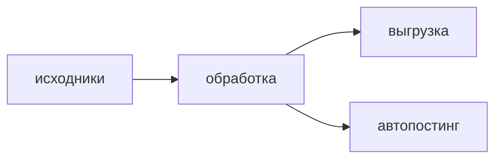

# Эталонное описание проекта

> Файл для сверки рендереров: клиента (`fs.manager.tauri`) и сайта (`innovation-hub`).
> Задействует **всё**, что разрешает [`DESCRIPTION_FORMAT_CONTRACT.md`](./DESCRIPTION_FORMAT_CONTRACT.md),
> и ничего сверх того. Расширяешь контракт — сначала дописываешь сюда.

## Текст и выделения

Обычный текст, **жирный**, *курсив*, ***жирный курсив***, ~~зачёркнутый~~,
<u>подчёркнутый</u>, <mark>выделенный маркером</mark> и `инлайн-код`.

Цвета палитры: <span class="fg-blue">blue</span>, <span class="fg-green">green</span>,
<span class="fg-orange">orange</span>, <span class="fg-red">red</span>,
<span class="fg-yellow">yellow</span>, <span class="fg-teal">teal</span>,
<span class="fg-purple">purple</span>, <span class="fg-cyan">cyan</span>,
<span class="fg-pink">pink</span>, <span class="fg-muted">muted</span>.

Внутри цвета markdown продолжает работать: <span class="fg-blue">**жирный синий**</span>.

Ступени насыщенности одного цвета: <span class="fg-blue">насыщенный</span>,
<span class="fg-blue-2">средний</span>, <span class="fg-blue-3">мягкий</span>.

Серая шкала от белого до чёрного: <span class="fg-gray-0">gray-0</span>,
<span class="fg-gray-1">gray-1</span>, <span class="fg-gray-2">gray-2</span>,
<span class="fg-gray-3">gray-3</span>, <span class="fg-gray-4">gray-4</span>,
<span class="bg-gray-0 fg-gray-5">gray-5 — читается только с заливкой</span>.

Заливка фона: <span class="bg-yellow">жёлтая подсветка</span>,
<span class="bg-teal">бирюзовая</span>, <span class="bg-red">красная</span>,
и сочетание цвета с заливкой: <span class="fg-red bg-yellow">красный на жёлтом</span>.

Мягкий перевод строки через тег:<br>вторая строка того же абзаца.

<p class="indent">Абзац с красной строкой. Первая строка сдвинута, остальные нет — проверять
надо именно на длинном тексте, иначе разницы не видно. Вот он и длинный: обработка забирает
исходники, гоняет их через пайплайн и раскладывает результат по папкам вывода.</p>

## Выравнивание

<div class="align-center">

**По центру** — обёртка отделена пустыми строками, иначе markdown внутри не разберётся.

</div>

<div class="align-right">

По правому краю.

</div>

<div class="align-justify">

По ширине — нужен длинный абзац, иначе выключка не видна. Обработка забирает исходники из папки
входа, гоняет их через пайплайн, раскладывает результат по папкам вывода и отдаёт статистику
в сайдкар проекта, откуда её читает сайт.

</div>

## Заголовки

### Третий уровень

#### Четвёртый уровень

## Списки

- обычный пункт
- пункт с **выделением**
  - вложенный
    - глубже

1. первый
2. второй
3. третий

- [x] сделано
- [ ] не сделано
- [ ] тоже не сделано

## Цитата

> Папка-проект — это адрес и артефакты, а база — это «кто что делает сейчас».
> Вторая строка цитаты.

## Таблица

Специально широкая — на узком экране должна прокручиваться внутри своего контейнера,
а не растягивать страницу.

| Нода | Тип | Вход | Выход | Комментарий |
|---|---|---|---|---|
| `music2signal` | сигнальная | audio | signal | огибающая одним проходом ffmpeg |
| `speech2signal` | сигнальная | audio | signal | по границам присутствия речи |
| `transcriptJSONnormalize` | преобразование | jsonFull | json | пословный JSON в лёгкий формат |
| `jsCode` | исполнение | any | any | произвольный JS, один раз за вызов |

## Код

```ts
const path = joinPath(projectPath, 'options', 'description.md');
await commands.writeFileAtomic(path, markdown);
```



Незнакомый язык фенса обязан выглядеть обычным блоком кода, а не ошибкой:

```someUnknownLang
это просто текст
```

## Ссылки и длинные строки

Обычная [ссылка](https://example.com), автоссылка <https://example.com/very/long>,
и намеренно длинный путь, который не должен распирать вёрстку:
`/Users/name/Desktop/WORK/projects/2026-08-19-very-long-project-name/options/description.md`

## Картинка

Никаких размеров в разметке — масштаб задаёт CSS рендерера.


## Сворачиваемый блок

<details>
<summary>Подробности, свёрнутые по умолчанию</summary>

Внутри — снова markdown: **жирный**, список,

- пункт один
- пункт два

и таблица:

| ключ | значение |
|---|---|
| a | 1 |

</details>

## Разделитель

---

Конец эталонного файла.
